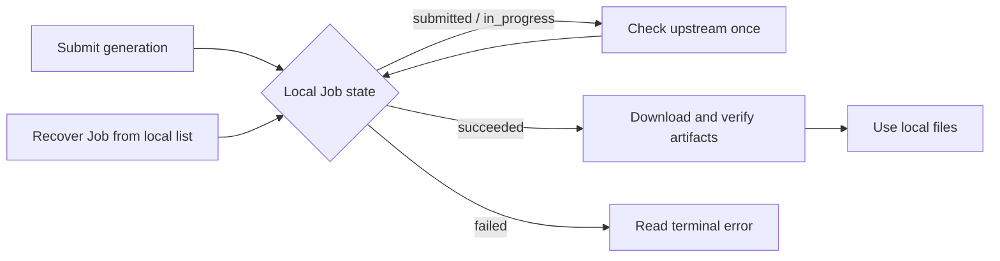

<!-- mcp-name: io.github.neutrinoy/modelscope-image-gen -->

<div align="center">
  <h1>ModelScope Image Gen MCP</h1>
  <p><strong>Reliable, recoverable, local-first ModelScope image generation</strong></p>
  <p>For MCP agents, MCP hosts, and local automation</p>
  <p><strong>English</strong> · <a href="README.zh-CN.md">简体中文</a></p>
</div>

---

Image generation does not always fit inside a single tool call. A task may still be queued after the agent has moved on, and an MCP host may exit before the image is ready. The hard part is not sending the request—it is preserving trustworthy facts across waiting, failure, recovery, and local delivery.

ModelScope Image Gen MCP turns that uncertainty into a clear workflow: **submit work, observe progress, recover context, and fetch artifacts**. Every generation has a persistent local Job, so an agent does not need to keep one long conversation alive or interpret ModelScope's raw responses.

- **Recoverable**: Jobs persist in SQLite across MCP calls and process restarts.
- **Truthful state**: Network errors, local wait limits, and unknown upstream states do not masquerade as task failure.
- **Multi-image by design**: Each image is downloaded, validated, stored, and retried independently.
- **Controlled artifacts**: The server verifies the actual image and commits it atomically under a managed root.
- **Actionable results**: Structured responses tell the agent when to check, fetch, or stop automatic retries.

## 🚀 Quick start

### 1. Prepare uv and Python

Install `uv >=0.11.28,<0.12`, make sure `uvx` is on `PATH`, and prepare Python 3.14:

```bash
uv python install 3.14
```

### 2. Configure the token

Obtain a ModelScope token and provide it through the MCP host environment:

```text
MODELSCOPE_SDK_TOKEN=replace-with-your-modelscope-token
```

Do not pass the token as a tool argument or commit it to the repository. A missing token does not prevent the server from starting; local listing, persisted terminal Jobs, and existing artifacts remain readable.

### 3. Connect an MCP host directly to GitHub

The current installation path uses this repository as the package source; no local clone or PyPI package is required:

```json
{
  "mcpServers": {
    "modelscope-image-gen": {
      "command": "uvx",
      "args": [
        "--prerelease=allow",
        "--from",
        "git+https://github.com/NeutrinoY/modelscope-image-gen.git@main",
        "modelscope-image-gen-mcp"
      ],
      "env": {
        "MODELSCOPE_SDK_TOKEN": "replace-with-your-modelscope-token"
      }
    }
  }
}
```

Save the configuration and restart the host; it should discover five tools. On first use, uv fetches the repository, builds the package, and creates an isolated cached tool environment. Later starts normally reuse that cache.

`--prerelease=allow` is currently required because the project uses the MCP Python SDK `2.0.0b1`. It can be removed only after the project moves to a verified stable SDK release.

> [!IMPORTANT]
> The PyPI project named `modelscope-image-gen-mcp` is maintained separately and is not a release of this repository. Use the Git URL above rather than bare `uvx modelscope-image-gen-mcp`.

Verify the remote installation without starting a long-lived MCP session:

```bash
uvx --prerelease=allow \
  --from "git+https://github.com/NeutrinoY/modelscope-image-gen.git@main" \
  modelscope-image-gen-mcp --version
```

The default `@main` reference follows the latest accepted source. Do not add `--refresh` to normal host configuration; use it explicitly only when an immediate cache refresh is intended. Replace `main` with a trusted tag or commit when an immutable installation is required.

<details>
<summary><strong>Develop from a local source checkout</strong></summary>

```bash
uv python install 3.14
uv sync --locked --all-groups
uv run modelscope-image-gen-mcp --version
```

For a local MCP host configuration, replace the path below with the absolute path to the checkout:

```json
{
  "mcpServers": {
    "modelscope-image-gen-dev": {
      "command": "uv",
      "args": [
        "--directory",
        "D:/absolute/path/to/modelscope-image-gen",
        "run",
        "modelscope-image-gen-mcp"
      ],
      "env": {
        "MODELSCOPE_SDK_TOKEN": "replace-with-your-modelscope-token"
      }
    }
  }
}
```

`uv --directory` avoids relying on a host-specific `cwd` field. Use forward slashes in Windows paths.

</details>

`stdout` is reserved for MCP protocol traffic. Runtime logs go to `stderr`.

## 🔄 How it works

The recommended workflow separates external task creation, status observation, and local artifact delivery:

```text
submit_image_generation
→ check_image_generation
→ check_image_generation again later, if still running
→ fetch_image_generation_result
```



### Asynchronous workflow

The asynchronous path is the default for agents and MCP hosts that can schedule follow-up calls:

1. `submit_image_generation` creates a ModelScope Task and immediately returns a local Job ID.
2. `check_image_generation` performs at most one upstream status request per call.
3. Once the Job reaches `succeeded`, `fetch_image_generation_result` downloads, verifies, and stores its images.
4. If the Job ID is lost, `list_image_generations` recovers it from local SQLite state.

No single call needs to wait for the whole generation. The agent can do other work between checks—or resume the same Job in a later conversation.

### Blocking convenience workflow

`generate_image` composes submit, check, and fetch into one blocking call for small scripts and short interactions. It reuses the same application use cases rather than maintaining a second polling and download implementation.

If the local wait budget expires, the call returns the still-running Job and a handoff action:

```text
completed=false
next_action.tool=check_image_generation
```

This does not mean that the ModelScope Task timed out or was canceled.

## 🎯 Where it fits

| A good fit | Not designed for |
|---|---|
| Long-running text-to-image work that can continue later | A thin synchronous API wrapper |
| MCP agents on a local or trusted workstation | A public multi-tenant generation platform |
| Jobs that must survive calls, conversations, or restarts | A web or desktop image library |
| Verified, persistent local image artifacts | Image-to-image, reference-image, or editing workflows |
| Stable state, errors, and next actions for agents | A multi-provider plugin marketplace or queue cluster |
| stdio hosts that share a machine or filesystem with the server | Remote HTTP file delivery or an OAuth control plane |

The project focuses on **ModelScope text-to-image generation over local stdio MCP**. It does not provide upstream cancellation, MCP Resources/Prompts, base64 image transport, or agent-controlled deletion.

## 🧰 Tool reference

The server publishes five tools in a fixed order:

| Tool | Purpose | Side effects | Typical next step |
|---|---|---|---|
| `submit_image_generation` | Create an asynchronous generation Job | Contacts ModelScope and may consume quota; non-idempotent | `check_image_generation` |
| `check_image_generation` | Refresh one active Job | Performs at most one upstream query and may update SQLite | Check again or fetch |
| `fetch_image_generation_result` | Materialize images for a succeeded Job | Downloads, validates, and writes missing artifacts | Fetch again if partial |
| `list_image_generations` | Read local Job summaries | Reads SQLite only; never contacts ModelScope | Resume by Job ID |
| `generate_image` | Block over submit, check, and fetch | Creates a task, waits, contacts the network, and writes files | Finish, or return to async check |

### Generation input

The smallest request contains only a prompt:

```json
{
  "prompt": "A quiet observatory above a sea of clouds"
}
```

A complete request:

```json
{
  "prompt": "A quiet observatory above a sea of clouds at dawn, cinematic architectural visualization",
  "model": "krea/Krea-2-Turbo",
  "size": {
    "width": 1024,
    "height": 1024
  },
  "negative_prompt": null,
  "seed": 42
}
```

| Field | Type | Default | Notes |
|---|---|---|---|
| `prompt` | string | required | Trimmed and must not be empty |
| `model` | string or null | `krea/Krea-2-Turbo` | Uses the server default when omitted |
| `size` | object | `1024 × 1024` | Uses `{width, height}` |
| `negative_prompt` | string or null | null | Empty text is normalized to null |
| `seed` | integer or null | null | Sent to ModelScope when present |
| `max_wait_seconds` | number or null | server default | `generate_image` only; range `1..3600` |

Agents cannot choose output directories or final filenames. Tool arguments also cannot relax byte, pixel, or concurrency safety limits.

### Local Job listing

`list_image_generations` accepts:

| Field | Type | Default | Notes |
|---|---|---|---|
| `statuses` | JobStatus array or null | null | Filter by local Job status |
| `limit` | integer | `20` | Range `1..100` |
| `cursor` | string or null | null | Opaque pagination cursor; copy it unchanged |

The list never returns prompts, provider image locators, or local artifact paths, and it never refreshes Jobs from ModelScope.

## 🧾 Result contract

Every known tool returns all three of the following:

- `structuredContent`: a strict result for agents and automation;
- `TextContent`: a concise summary of the operation, current state, and next step;
- `isError`: derived directly from `ok` in the structured result.

The common envelope is:

```json
{
  "ok": true,
  "data": {},
  "error": null
}
```

Two facts must remain separate:

- `ok` describes whether this tool operation completed successfully;
- `job.status` describes the image-generation Job itself.

Reading a terminal `status=failed` Job can therefore be a successful check with `ok=true`. A fetch is also `ok=true` with `partial=true` when at least one image is available.

Structured results include a next action when appropriate:

```json
{
  "next_action": {
    "tool": "check_image_generation",
    "job_id": "019f...",
    "recommended_wait_seconds": 5
  }
}
```

The agent does not have to guess which tool comes next.

## 📦 Local artifacts

MCP responses do not carry the full image. The server first saves it as a local file, then returns information that can locate and verify the artifact:

```text
ModelScope Task succeeds
→ download image bytes
→ validate format, dimensions, and pixel count
→ atomically commit under the Artifact Store
→ persist metadata in SQLite
→ return the local path and SHA-256
```

An available image typically contains:

```json
{
  "image_id": "019f...",
  "position": 0,
  "artifact_status": "available",
  "file_path": "C:/Users/.../artifacts/jobs/.../000-....png",
  "relative_path": "jobs/.../000-....png",
  "sha256": "...",
  "byte_size": 1034118,
  "media_type": "image/png",
  "format": "PNG",
  "width": 1024,
  "height": 1024
}
```

Repeated fetches return images that are already available without downloading or overwriting them. If a complete file was atomically committed but its SQLite update failed, a later fetch can inspect the file and repair its metadata.

**File visibility:** `file_path` is absolute on the server machine. Containers, sandboxes, WSL, virtual machines, and remote hosts must mount the Artifact Root somewhere both sides can access. The project does not transport large files through MCP Resources or base64.

## 🛡️ Reliability semantics

### Jobs and artifacts are separate facts

Job states:

```text
submitting → submitted → in_progress → succeeded
          └──────────────────────────→ failed
```

Per-image artifact states:

```text
pending → available
       └→ failed
```

A Job may already be `succeeded` upstream while one or more local image downloads fail. Artifact failure does not erase the success that ModelScope has already confirmed.

### Uncertainty is not failure

- A local wait limit is not a Job state.
- A network error during check does not mark the Job `failed`.
- An unknown provider state is not guessed to be `in_progress` or `failed`.
- Canceling a local call is not reported as upstream Task cancellation.

### Unknown submission outcome

The server persists a `submitting` Job before contacting ModelScope. If the request may have reached ModelScope but no reliable Task ID was recorded, the Job stores:

```text
SUBMISSION_OUTCOME_UNKNOWN
possibly_submitted=true
```

> [!WARNING]
> Do not automatically submit the same request again. The first request may already have created an external Task and consumed quota; resubmission can create duplicate work.

### Multiple images and partial success

A succeeded Job can contain multiple images. Each image keeps its own artifact state and error. A later fetch processes only unfinished or failed images and never discards files that are already available.

## 🔐 Local data and privacy

Formal Jobs and images live in the current user's data directory—not in the package installation, source checkout, or an `uvx` environment:

```text
<data_dir>/
├── state.sqlite3
└── artifacts/
    └── jobs/
        └── <job_id>/
            └── 000-<image_id>.<verified-extension>
```

Typical defaults:

```text
Windows: %LOCALAPPDATA%/modelscope-image-gen-mcp/
macOS:   ~/Library/Application Support/modelscope-image-gen-mcp/
Linux:   ~/.local/share/modelscope-image-gen-mcp/
```

To recover complete Jobs, SQLite stores prompts, negative prompts, ModelScope Task references, provider image locators, safe errors, and artifact metadata. Treat the following as sensitive local data:

- `state.sqlite3`, its WAL/SHM files, and backups;
- generated images and temporary artifacts;
- MCP host configuration containing the token.

Security boundaries:

- Tokens and Authorization headers are never written to SQLite.
- Tool results do not expose provider image locators.
- List results do not expose prompts or artifact paths.
- Default logs omit prompts, locators, raw upstream bodies, and absolute artifact paths.
- `stdout` carries MCP wire traffic only; logs go to `stderr`.
- Formal Jobs and images are not deleted automatically by default.

See [SECURITY.md](SECURITY.md) for vulnerability reporting and token-exposure response.

## ⚙️ Configuration

Common settings:

| Environment variable | Default | Purpose |
|---|---:|---|
| `MODELSCOPE_SDK_TOKEN` | empty | Secret token for ModelScope access |
| `MODELSCOPE_IMAGE_GEN_DEFAULT_MODEL` | `krea/Krea-2-Turbo` | Default text-to-image model |
| `MODELSCOPE_IMAGE_GEN_DATA_DIR` | platform user data | Runtime data root |
| `MODELSCOPE_IMAGE_GEN_ARTIFACT_ROOT` | `<data_dir>/artifacts` | Controlled artifact root |
| `MODELSCOPE_IMAGE_GEN_DEFAULT_MAX_WAIT_SECONDS` | `600` | Local wait budget for `generate_image` |
| `MODELSCOPE_IMAGE_GEN_LOG_LEVEL` | `INFO` | `stderr` log level |

<details>
<summary>Show all environment variables</summary>

| Environment variable | Default | Purpose |
|---|---:|---|
| `MODELSCOPE_IMAGE_GEN_API_BASE` | `https://api-inference.modelscope.cn/` | ModelScope HTTPS API base |
| `MODELSCOPE_IMAGE_GEN_DATABASE_PATH` | `<data_dir>/state.sqlite3` | SQLite database path |
| `MODELSCOPE_IMAGE_GEN_SUBMIT_TIMEOUT_SECONDS` | `30` | Submit request timeout |
| `MODELSCOPE_IMAGE_GEN_STATUS_TIMEOUT_SECONDS` | `30` | Status request timeout |
| `MODELSCOPE_IMAGE_GEN_DOWNLOAD_TIMEOUT_SECONDS` | `60` | Image download timeout |
| `MODELSCOPE_IMAGE_GEN_BLOCKING_POLL_INTERVAL_SECONDS` | `5` | Check interval used by `generate_image` |
| `MODELSCOPE_IMAGE_GEN_MAX_CONCURRENT_DOWNLOADS` | `4` | Per-fetch download concurrency |
| `MODELSCOPE_IMAGE_GEN_MAX_DOWNLOAD_BYTES` | `52428800` | Per-image byte limit |
| `MODELSCOPE_IMAGE_GEN_MAX_IMAGE_PIXELS` | `40000000` | Per-image pixel limit |
| `MODELSCOPE_IMAGE_GEN_TERMINAL_JOB_RETENTION_DAYS` | `0` | `0` disables formal-data deletion |
| `MODELSCOPE_IMAGE_GEN_TEMP_FILE_RETENTION_HOURS` | `24` | Retention for temporary `.part` files |

</details>

See [.env.example](.env.example) for a copyable template. Environment changes require a server restart.

## 🩺 Recovery and troubleshooting

| Symptom | What to do |
|---|---|
| uvx reports that `mcp==2.0.0b1` or `mcp-types==2.0.0b1` cannot be resolved | Confirm that `--prerelease=allow` appears before `--from` in the host args |
| Git installation cannot fetch or build | Check GitHub access, the repository owner/ref, uv `>=0.11.28,<0.12`, and Python 3.14; run the documented `--version` command outside the host |
| The host still runs older cached source | Stop the host, run the `--version` command once with `--refresh`, then restart; do not make refresh the permanent default |
| `MODELSCOPE_TOKEN_MISSING` | Set the token and restart the server; local listing still works |
| `SUBMISSION_OUTCOME_UNKNOWN` | Do not automatically resubmit; inspect the existing Job and diagnostic request ID |
| `NETWORK_ERROR` / `UPSTREAM_HTTP_ERROR` during check | The Job keeps its prior state; follow `retryable`, `retry_after_seconds`, and `next_action` |
| `UPSTREAM_STATUS_UNKNOWN` | Check again later; do not guess a terminal state |
| Partial fetch | Fetch again; available images are skipped |
| Lost Job ID | Use list, optionally filtered by `statuses`, and follow the cursor |
| Host cannot read an image | Confirm that the host can access the server's Artifact Root |
| Artifact save failure | Check permissions, disk space, and security software; a later fetch may repair metadata for an existing file |

## 🧱 Architecture

```text
mcp_adapter ───────┐
                   v
              application
                   v
                domain
                   ^
              application ports
                   ^
infrastructure ────┘

bootstrap → the only composition root
cli       → bootstrap
```

- `domain/`: immutable business facts, state transitions, and invariants;
- `application/`: use cases, ports, provider outcomes, results, and safe views;
- `infrastructure/`: ModelScope HTTP, SQLite, the Artifact Store, configuration, and locks;
- `mcp_adapter/`: Pydantic wire models, ToolContract, handlers, presenters, and the low-level MCP server;
- `bootstrap.py`: resource construction, startup recovery, and lifecycle.

The provider owns HTTP requests and image-stream lifecycles. The Artifact Store owns bytes, validation, and controlled paths. The MCP adapter never reaches into concrete infrastructure.

## 🕰️ From prototype to reliable workflow

The project did not begin with its current shape. Its history is less about accumulating features than repeatedly asking a harder question: for a long-running image-generation task that can fail or be interrupted, which facts should the system trust and preserve?

### `0.1.0` — Prove the direction

In March 2026, the project went from an empty scaffold to a working prototype in a single evening. It first proved that agents could use ModelScope's asynchronous image generation through MCP, and that a long-running operation could be split into submission, status checks, and result retrieval.

That version already had local Jobs, structured errors, and image-content validation. It also carried the marks of a fast prototype: one JSON file per task, mutable dictionaries, a single-image assumption, duplicated workflows, and agent-controlled output paths.

It proved that the idea worked and left the more important question for the next stage: if work must survive conversations and process restarts, how can the system keep its state clear and trustworthy over time?

The original implementation is preserved as a read-only historical baseline under [`legacy/v0.1.0/`](legacy/v0.1.0/).

### `0.2.0` — From working tool to local task system

In July 2026, the project stopped building on top of the prototype and rebuilt around task semantics, data boundaries, artifact delivery, and agent experience.

From this version onward, a network request was no longer the same thing as a Job. A local wait limit no longer meant task failure, and an image download problem no longer erased success already confirmed upstream. SQLite persistence, an explicit state machine, multi-image results, a controlled Artifact Store, and stable MCP contracts formed a new reliability boundary.

The rebuild carried forward the behavior that `0.1.0` had validated without translating its internal structure line by line. The product, domain, storage, and interface decisions behind it are preserved under [`docs/rebuild/`](docs/rebuild/).

### `0.2.1` — Make the boundaries hold under real use

`0.2.1` is not about expanding the feature list. It is about making the established design withstand code review, real ModelScope workflows, and multiple stdio MCP hosts.

This stage tightened cancellation and concurrency behavior, database-and-file commit boundaries, provider network lifecycles, list privacy, and cross-platform path safety. The system now holds together not only on the happy path, but also across interrupted calls, malformed responses, partial success, and real host environments.

The point of this version line has never been to accumulate more features. It is to make the answer to “which facts can be trusted?” increasingly precise.

See [CHANGELOG.md](CHANGELOG.md) for exact changes and compatibility boundaries.

## 🧪 Development

Common quality gates:

```bash
uv lock --check
uv sync --locked --all-groups
uv run ruff format --check
uv run ruff check
uv run ty check
uv run pytest
uv build --no-sources
```

The default test suite does not contact ModelScope. Run live tests only when external calls and quota consumption are explicitly intended:

```bash
MODELSCOPE_IMAGE_GEN_RUN_LIVE_TESTS=1 \
MODELSCOPE_SDK_TOKEN=replace-with-your-modelscope-token \
uv run pytest -m live
```

See the [project maintenance and handoff handbook](docs/maintenance/README.md) for deeper architecture boundaries, change paths, and verification requirements.

## 🙏 Inspiration and acknowledgements

This project was inspired by [`zym9863/modelscope-image-mcp`](https://github.com/zym9863/modelscope-image-mcp).

The original project offered a clear and practical demonstration of bringing ModelScope image generation to MCP. This repository continues along that path by exploring submission, status observation, context recovery, and local artifact delivery for long-running agent workflows, with persistent Jobs, multi-image results, structured tool contracts, and safe local storage.

Thank you to the original author for sharing that work in the open. Projects that can be read, tested, and reconsidered are what make later refinement, rebuilding, and extension possible.

We are also grateful to the MCP, ModelScope, uv, HTTPX, Pydantic, SQLite, AnyIO, and Pillow communities for the infrastructure and sustained work behind this project.

## 📌 Support and license

- Questions and bug reports: [GitHub Issues](https://github.com/NeutrinoY/modelscope-image-gen/issues)
- Security reports and secret exposure: [SECURITY.md](SECURITY.md)
- Version changes and upgrade boundaries: [CHANGELOG.md](CHANGELOG.md)
- License: [MIT License](LICENSE)
