# ModelScope Image Gen MCP

[中文文档](README.zh-CN.md)

Python MCP server for ModelScope image generation.

This server provides an async workflow for long-running image generation jobs, together with a blocking convenience call for simple scripts. It is intended for developers integrating ModelScope image generation into MCP hosts, agents, or local automation.

## ✨ Overview

- Four MCP tools: `submit_image_generation`, `get_image_generation_status`, `get_image_generation_result`, and `generate_image`
- A non-blocking workflow for long-running generations
- A blocking one-call workflow for quick usage
- Structured MCP results for automation (`ok/data/error`)
- Local job-state storage for polling and later result retrieval

## 🚀 Quick Start

Requirements:

- Python `>=3.12`
- `uv`
- `MODELSCOPE_SDK_TOKEN`

### Published package configuration

If the package has been published, an MCP client can be configured like this:

```json
{
  "mcpServers": {
    "modelscope-image-gen-mcp": {
      "command": "uvx",
      "args": ["modelscope-image-gen-mcp"],
      "env": {
        "MODELSCOPE_SDK_TOKEN": "your_token"
      }
    }
  }
}
```

### Local development startup

```bash
uv sync --dev
export MODELSCOPE_SDK_TOKEN="your_token"
uv run modelscope-image-gen-mcp
```

Alternative entrypoint:

```bash
uv run python main.py
```

### Local development client configuration

For a local checkout during development:

```json
{
  "mcpServers": {
    "modelscope-image-gen-mcp": {
      "command": "uv",
      "args": ["run", "modelscope-image-gen-mcp"],
      "cwd": "/absolute/path/to/modelscope-image-gen",
      "env": {
        "MODELSCOPE_SDK_TOKEN": "your_token"
      }
    }
  }
}
```

## 🔄 Workflow Model

### Async workflow

Use this when image generation may take a while or when the caller needs to continue doing other work.

1. Call `submit_image_generation`
2. Poll with `get_image_generation_status`
3. When the job is ready, call `get_image_generation_result`

This flow is the recommended default for agents and MCP hosts that can schedule follow-up calls.

Typical lifecycle:

```mermaid
gantt
    title Async Image Generation Lifecycle
    dateFormat  X
    axisFormat %s

    section Client or Agent
    Submit job                 :milestone, m1, 0, 0
    Continue other work        :active, a1, 0, 4
    Poll status                :a2, 1, 3
    Fetch final result         :milestone, m2, 4, 0

    section Server
    Create local job record    :b1, 0, 1
    Track upstream progress    :b2, 1, 3
    Download and save output   :b3, 4, 1
```



### Blocking workflow

Use `generate_image` when a single synchronous call is more convenient than explicit job orchestration.

## 🛠 Tool Reference

| Tool | Purpose | Required Args | Typical Next Step |
|---|---|---|---|
| `submit_image_generation` | Start a non-blocking generation job | `prompt` | Poll with `get_image_generation_status` |
| `get_image_generation_status` | Read current job state and progress metadata | `job_id` | If ready, call `get_image_generation_result` |
| `get_image_generation_result` | Download and save the final image for a completed job | `job_id` | Consume the saved local path and metadata |
| `generate_image` | Submit, poll, download, and save in one blocking call | `prompt` | No follow-up tool call needed |

Generation tools support these optional arguments:

- `model`
- `size`
- `output_filename`
- `output_dir`
- `poll_interval_seconds`
- `max_poll_attempts`
- `poll_backoff`
- `max_poll_interval_seconds`
- `negative_prompt`
- `seed`

Validation rules documented by the server include:

- `size` must use `WIDTHxHEIGHT`
- width and height must be within `64` to `1664`
- `max_poll_attempts >= 1`
- polling interval values must be non-negative

## 📦 Response Contract

All tools return MCP `CallToolResult` values with text content plus `structuredContent`.

Success payload shape:

```json
{
  "ok": true,
  "data": {
    "job_id": "...",
    "state": "submitted|in_progress|succeeded|failed|timeout"
  }
}
```

The `state` value above is illustrative rather than exhaustive.

Error payload shape:

```json
{
  "ok": false,
  "error": {
    "stage": "validation|request|submit|poll|download|decode|save|storage|result|unexpected",
    "reason_code": "...",
    "category": "validation|network|upstream_http|upstream_task|upstream_response|timeout|local_io|internal|state|data_format",
    "retryable": false,
    "retry_after_seconds": 1,
    "detail": "...",
    "suggestion": "..."
  }
}
```

Depending on the workflow stage, response data may also include fields such as:

- `next_action`
- `recommended_wait_seconds`
- `result_ready`
- `local_file_ready`
- `output_path`
- `last_error`

For automation, `reason_code`, `category`, `retryable`, and stage-specific follow-up fields are usually the most useful signals.

## ⚙ Configuration

### Environment Variables

| Variable | Default | Description |
|---|---|---|
| `MODELSCOPE_SDK_TOKEN` | `""` | ModelScope API token; required at runtime |
| `MODELSCOPE_API_BASE` | `https://api-inference.modelscope.cn/` | API base URL |
| `MODELSCOPE_LOG_LEVEL` | `INFO` | Log level |
| `MODELSCOPE_POLL_INTERVAL_SECONDS` | `5` | Base polling interval |
| `MODELSCOPE_MAX_POLL_ATTEMPTS` | `120` | Max poll attempts |
| `MODELSCOPE_POLL_BACKOFF` | `false` | Enable exponential polling backoff |
| `MODELSCOPE_MAX_POLL_INTERVAL_SECONDS` | `30` | Max interval when backoff is enabled |
| `MODELSCOPE_SUBMIT_TIMEOUT_SECONDS` | `30` | Submit HTTP timeout |
| `MODELSCOPE_POLL_TIMEOUT_SECONDS` | `30` | Poll HTTP timeout |
| `MODELSCOPE_DOWNLOAD_TIMEOUT_SECONDS` | `60` | Download HTTP timeout |
| `MODELSCOPE_JOB_STATE_DIR` | `./.modelscope-image-gen-mcp/jobs` | Local job-state directory |

### Runtime Notes

- Transport: MCP `stdio`
- Current MCP capability type: `Tools`
- Main command: `uv run modelscope-image-gen-mcp`
- Default model: `Qwen/Qwen-Image`

## 📝 Operational Notes

- Use the async workflow when generations may outlive a single conversational turn.
- `get_image_generation_status` can return terminal failure metadata without downloading any file.
- `get_image_generation_result` returns an error if the job is not ready yet.
- Local job data is stored under `MODELSCOPE_JOB_STATE_DIR` and is used for later status/result lookups.

## 🔧 Development

```bash
# format
uv run ruff format

# lint
uv run ruff check

# tests
uv run pytest -q

# build
uv build
```

## 🩺 Troubleshooting

- `MODELSCOPE_SDK_TOKEN environment variable is required`
  - Set the token and restart your MCP host or server process.
- `Connection closed` or other network errors
  - Check network access, proxy settings, and TLS configuration.
- The job stays in `in_progress`
  - Continue polling or increase polling limits if the upstream queue is slow.
- Download succeeded but local save failed
  - Check output directory permissions, available disk space, and filename validity.

## 🧱 Architecture

The codebase is organized into a small set of layers:

- `mcp/` for MCP server wiring, tool metadata, and argument validation
- `services/workflows/` for submit, status, result, and blocking generate flows
- `infrastructure/` for API access and local job-state storage

This split keeps the MCP surface, workflow logic, and persistence concerns separate.

## 🙏 Inspiration and Acknowledgements

This project is inspired by [`zym9863/modelscope-image-mcp`](https://github.com/zym9863/modelscope-image-mcp).

The original project established a practical starting point for using ModelScope image generation over MCP. This repository builds on that direction with a stronger focus on developer-facing async orchestration, structured tool contracts, and long-running workflow handling.

Thanks to the original author for publishing a useful reference implementation and making this follow-up work possible.

## 📄 License

This project is intended to use the MIT License.

Before release or publication, add the `LICENSE` file and project metadata so the repository state matches that intent.
