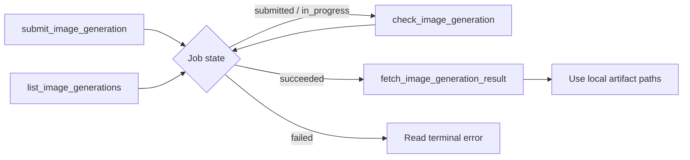

# ModelScope Image Gen MCP

<!-- mcp-name: io.github.neutrinoy/modelscope-image-gen -->

A local-first MCP v2 server for reliable ModelScope text-to-image generation. It turns ModelScope's asynchronous API into persistent, recoverable Agent workflows with SQLite job state, safe local artifacts, structured errors, and multi-image results.

> Status: `0.2.1` is a reliability and integration update to the completed rebuild. Real submit → check → fetch and blocking generate workflows have passed with `krea/Krea-2-Turbo`, and all five tools have been exercised from two real stdio MCP Hosts, including Claude Code. Ubuntu CI, Registry, and PyPI publication remain separate release gates.

[简体中文](README.zh-CN.md)

## Overview

- Five MCP tools with a fixed, Agent-oriented workflow
- ModelScope asynchronous submission and status tracking
- SQLite persistence across MCP calls and process restarts
- Startup recovery for uncertain submissions
- Multi-image jobs and partial artifact success
- Controlled local Artifact Store with byte, pixel, format, and path checks
- Structured `ok/data/error` responses plus concise TextContent
- stdio MCP v2, Python 3.14, uv, wheel, and `uvx` support

## Scope

V1 includes text-to-image generation with ModelScope, stdio MCP v2, persistent local jobs, multi-image artifact fetching, and PyPI/`uvx` packaging.

V1 does not include image editing, reference images, multiple providers, HTTP deployment, OAuth, MCP Resources/Prompts/Tasks, Agent-controlled deletion, or upstream cancellation.

## Requirements

- Python `>=3.14,<3.15`
- `uv >=0.11.28,<0.12`
- A ModelScope token for operations that contact ModelScope

The server can start without a token. Local listing, persisted terminal facts, and already-available artifacts remain usable.

## Quick start

Check the packaged command:

```bash
uvx modelscope-image-gen-mcp --version
```

Set the token in the MCP Host environment rather than passing it as a tool argument:

```text
MODELSCOPE_SDK_TOKEN=replace-with-your-modelscope-token
```

Run the stdio server:

```bash
uvx modelscope-image-gen-mcp
```

For local development, `.env` and `.env.local` are both supported. `.env.local` is Git-ignored:

```bash
cp .env.example .env.local
uv sync --locked --all-groups
uv run modelscope-image-gen-mcp
```

## MCP Host configuration

The same configuration shape works on Windows, macOS, and Linux when `uvx` is on `PATH`:

```json
{
  "mcpServers": {
    "modelscope-image-gen": {
      "command": "uvx",
      "args": ["modelscope-image-gen-mcp"],
      "env": {
        "MODELSCOPE_SDK_TOKEN": "replace-with-your-modelscope-token"
      }
    }
  }
}
```

For development from this checkout:

```json
{
  "mcpServers": {
    "modelscope-image-gen-dev": {
      "command": "uv",
      "args": [
        "--directory",
        "/absolute/path/to/modelscope-image-gen",
        "run",
        "modelscope-image-gen-mcp"
      ],
      "env": {
        "MODELSCOPE_SDK_TOKEN": "replace-with-your-modelscope-token"
      }
    }
  }
}
```

Use a Windows absolute path such as `D:/Code/modelscope-image-gen` for the `--directory` argument on Windows. This form works in Hosts that expose only command, arguments, and environment fields.

## Workflow model

### Recommended asynchronous workflow

```text
submit_image_generation
→ check_image_generation
→ check_image_generation, if still running
→ fetch_image_generation_result
```



Use this workflow when generation may outlive one Agent turn or when the caller can schedule follow-up work. If the Job ID is lost, recover it with `list_image_generations`.

### Blocking convenience workflow

Use `generate_image` when one blocking call is more convenient. It composes submit, check, and fetch, but it is not the preferred default for schedulable Agents.

When the local wait budget expires, `generate_image` returns the still-running Job and a `check_image_generation` next action. It does not convert the Job to a timeout state and does not claim that ModelScope canceled the task.

## Tool reference

Tools are published in this fixed order:

| Tool | Required input | Side effects | Typical next step |
|---|---|---|---|
| `submit_image_generation` | `prompt` | Creates an external task and may consume quota; non-idempotent | `check_image_generation` |
| `check_image_generation` | `job_id` | Performs at most one upstream query and may update SQLite | Check again or fetch |
| `fetch_image_generation_result` | `job_id` | Downloads, validates, and writes missing local artifacts | Retry only if partial |
| `list_image_generations` | none | Reads local SQLite only | Resume with check or fetch |
| `generate_image` | `prompt` | Creates a task, waits, queries, downloads, and writes files | None, or check after wait handoff |

Generation input fields:

| Field | Type | Default | Notes |
|---|---|---|---|
| `prompt` | string | required | Trimmed and must be non-empty |
| `model` | string or null | `krea/Krea-2-Turbo` | Server default when omitted |
| `size` | object | `{"width":1024,"height":1024}` | Positive width and height; Provider applies model limits |
| `negative_prompt` | string or null | null | Empty text becomes null |
| `seed` | integer or null | null | Passed to ModelScope when present |
| `max_wait_seconds` | number or null | server default | `generate_image` only; range `1..3600` |

List input fields:

| Field | Type | Default | Notes |
|---|---|---|---|
| `statuses` | JobStatus array or null | null | Stable de-duplicated filter |
| `limit` | integer | `20` | Range `1..100` |
| `cursor` | string or null | null | Opaque keyset cursor; copy it without parsing |

Example generation input:

```json
{
  "prompt": "A quiet observatory above a sea of clouds",
  "model": "krea/Krea-2-Turbo",
  "size": {"width": 1024, "height": 1024},
  "negative_prompt": null,
  "seed": 42
}
```

Agents cannot choose output directories or filenames. The server owns all artifact paths.

## Response contract

Every known tool returns:

- exactly one concise text summary;
- `structuredContent` with a concrete tool envelope;
- `isError` derived directly from `ok`.

Successful submit shape:

```json
{
  "ok": true,
  "data": {
    "job": {
      "job_id": "019f...",
      "status": "submitted",
      "artifact_status": "not_ready",
      "model": "krea/Krea-2-Turbo",
      "size": {"width": 1024, "height": 1024},
      "next_action": {
        "tool": "check_image_generation",
        "job_id": "019f...",
        "recommended_wait_seconds": 5
      }
    },
    "accepted": true
  },
  "error": null
}
```

Error shape:

```json
{
  "ok": false,
  "data": null,
  "error": {
    "code": "MODELSCOPE_TOKEN_MISSING",
    "stage": "configuration",
    "category": "configuration",
    "retryable": false,
    "retry_after_seconds": null,
    "message": "MODELSCOPE_SDK_TOKEN is required to create or refresh ModelScope jobs.",
    "possibly_submitted": false,
    "provider_request_id": null,
    "next_action": null
  }
}
```

A successfully read `status=failed` Job is a successful check operation: `ok=true`, while the Job contains its terminal error. A partial fetch is also `ok=true` when at least one artifact is available.

## Job and artifact semantics

Job states are:

```text
submitting → submitted → in_progress → succeeded
          └──────────────────────────→ failed
```

`timeout` is not a Job state. Network failures and unknown Provider status values do not fabricate a terminal Job failure.

A succeeded Job can contain multiple images. Each image independently moves through `pending`, `available`, or `failed`. Fetch can therefore return partial success, and retrying fetch only processes unfinished images.

Submission intent is persisted before the external request. If the process stops before a reliable ModelScope task ID is recorded, startup recovery marks the Job as `SUBMISSION_OUTCOME_UNKNOWN` with `possibly_submitted=true`; the same request must not be automatically resubmitted.

## Local data and privacy

By default, platform-specific user data directories are selected with `platformdirs`:

```text
<data_dir>/state.sqlite3
<data_dir>/artifacts/jobs/<job_id>/...
```

SQLite stores prompts, negative prompts, Provider task references, Provider image locators, safe errors, and local artifact metadata so jobs can be fully recovered. Treat the SQLite database, WAL/SHM files, backups, and generated images as sensitive local data.

The token and Authorization header are never persisted. Default logs suppress HTTP request URLs and do not contain prompts, Provider image locators, raw upstream bodies, or artifact absolute paths. stdio protocol traffic uses stdout; logs use stderr.

Formal jobs and images are not automatically deleted by default. Temporary `.part` files are cleaned after the configured retention period. Optional terminal-job retention uses a cleanup queue so database and filesystem cleanup remain recoverable.

## Configuration

| Environment variable | Default | Purpose |
|---|---:|---|
| `MODELSCOPE_SDK_TOKEN` | empty | Secret token for upstream operations |
| `MODELSCOPE_IMAGE_GEN_API_BASE` | ModelScope inference API | HTTPS API base |
| `MODELSCOPE_IMAGE_GEN_DEFAULT_MODEL` | `krea/Krea-2-Turbo` | Default model |
| `MODELSCOPE_IMAGE_GEN_DATA_DIR` | platform user data | Runtime data root |
| `MODELSCOPE_IMAGE_GEN_DATABASE_PATH` | `<data_dir>/state.sqlite3` | SQLite path |
| `MODELSCOPE_IMAGE_GEN_ARTIFACT_ROOT` | `<data_dir>/artifacts` | Controlled artifact root |
| `MODELSCOPE_IMAGE_GEN_SUBMIT_TIMEOUT_SECONDS` | `30` | Submit request timeout |
| `MODELSCOPE_IMAGE_GEN_STATUS_TIMEOUT_SECONDS` | `30` | Status request timeout |
| `MODELSCOPE_IMAGE_GEN_DOWNLOAD_TIMEOUT_SECONDS` | `60` | Artifact request timeout |
| `MODELSCOPE_IMAGE_GEN_BLOCKING_POLL_INTERVAL_SECONDS` | `5` | Blocking workflow polling interval |
| `MODELSCOPE_IMAGE_GEN_DEFAULT_MAX_WAIT_SECONDS` | `600` | Blocking local wait budget |
| `MODELSCOPE_IMAGE_GEN_MAX_CONCURRENT_DOWNLOADS` | `4` | Per-fetch image concurrency |
| `MODELSCOPE_IMAGE_GEN_MAX_DOWNLOAD_BYTES` | `52428800` | Per-image byte limit |
| `MODELSCOPE_IMAGE_GEN_MAX_IMAGE_PIXELS` | `40000000` | Per-image pixel limit |
| `MODELSCOPE_IMAGE_GEN_TERMINAL_JOB_RETENTION_DAYS` | `0` | `0` disables formal-data deletion |
| `MODELSCOPE_IMAGE_GEN_TEMP_FILE_RETENTION_HOURS` | `24` | Temporary-file retention |
| `MODELSCOPE_IMAGE_GEN_LOG_LEVEL` | `INFO` | stderr log level |

See `.env.example` for a copyable template. Environment changes require a server restart.

## Runtime and operational notes

- Transport: MCP stdio
- Capability: Tools only
- Default model: `krea/Krea-2-Turbo`
- Persistent store: SQLite plus controlled local artifact files
- Same-Job check/fetch calls are serialized inside one process
- Different Jobs can progress concurrently
- Token changes require a restart
- Multiple server processes sharing one data directory are not supported in V1

## Troubleshooting and recovery

- **`MODELSCOPE_TOKEN_MISSING`** — set `MODELSCOPE_SDK_TOKEN` and restart. Local list operations still work.
- **`SUBMISSION_OUTCOME_UNKNOWN`** — do not automatically resubmit; the first request may have reached ModelScope.
- **`NETWORK_ERROR` / `UPSTREAM_HTTP_ERROR` during check** — the Job keeps its previous state. Follow the returned retry guidance.
- **`UPSTREAM_STATUS_UNKNOWN`** — the local Job state is not fabricated; check again later and use the Provider request ID for diagnostics when present.
- **Partial fetch** — call `fetch_image_generation_result` again. Available files are skipped.
- **Lost Job ID** — use `list_image_generations`, optionally filtered by status.
- **Artifact save failure** — check artifact-root permissions and available disk space; a complete file may be repaired into SQLite on the next fetch.

## Architecture

```text
mcp_adapter ───────┐
                   ↓
              application
                   ↓
                domain
                   ↑
              application ports
                   ↑
infrastructure ────┘

bootstrap → composition root
cli       → bootstrap
```

- `domain/` contains immutable business facts, status transitions, and invariants.
- `application/` contains use cases, ports, Provider outcomes, and operation results.
- `infrastructure/` contains ModelScope HTTP, SQLite, artifacts, configuration, locks, and system adapters.
- `mcp_adapter/` contains Pydantic wire models, ToolContract, handlers, presenters, and the low-level MCP v2 Server.
- `bootstrap.py` owns resource construction and lifespan; package import has no runtime side effects.

## Development and verification

```bash
uv sync --locked --all-groups
uv run ruff format --check
uv run ruff check
uv run ty check
uv run pytest
uv build --no-sources
```

Run an explicit live test only when quota consumption is intended:

```bash
MODELSCOPE_IMAGE_GEN_RUN_LIVE_TESTS=1 \
MODELSCOPE_SDK_TOKEN=replace-with-your-modelscope-token \
uv run pytest -m live
```

The default test suite uses MockTransport and the official in-memory MCP client; it does not contact ModelScope. Release verification distinguishes automated tests, installed-wheel stdio smoke tests, real Host tests, real ModelScope runs, Registry configuration, and actual publication.

## Inspiration and acknowledgements

This project was inspired by [`zym9863/modelscope-image-mcp`](https://github.com/zym9863/modelscope-image-mcp), which provided a useful early example of exposing ModelScope image generation through MCP.

The archived `legacy/v0.1.0/` implementation preserves the repository's first asynchronous workflow and structured-result experiments. The `0.2.0` line inherits its verified behavior lessons, not its Mixin, dictionary-state, path-control, or MCP v1 structure.

## Security, history, and license

See [SECURITY.md](SECURITY.md) for private reporting and token-leak response. See [CHANGELOG.md](CHANGELOG.md) for breaking tool and schema changes.

The read-only `legacy/v0.1.0/` archive is excluded from the root package, lint, type check, and test project.

License: MIT. See [LICENSE](LICENSE).
