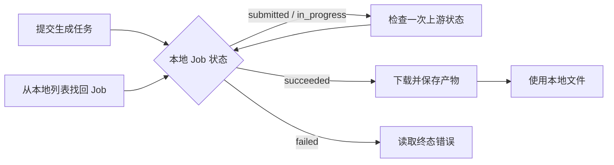

# ModelScope Image Gen MCP

<!-- mcp-name: io.github.neutrinoy/modelscope-image-gen -->

> 面向 MCP Agent 的可靠、本地优先 ModelScope 图像生成服务。

图像生成并不总能在一次调用里结束。任务可能需要排队，可能跨越多轮 Agent 交互，也可能在 MCP Host 重启后仍然继续运行。真正棘手的并不是“发送一个 HTTP 请求”，而是如何在等待、失败、恢复和结果落盘之间保留足够清晰的事实。

ModelScope Image Gen MCP 将这段漫长而不确定的过程整理为一套明确的本地工作流：**提交任务、观察进度、恢复上下文、获取产物**。Agent 不需要猜测下一步，也不需要把一次生图任务绑定在一条持续不断的会话上。

[English](README.md)

## ✨ 为什么是它？

它不是一次 ModelScope API 调用的简单包装，而是为长耗时 Agent 工作流准备的一层可靠性边界。

- **适合异步协作**：提交后立即获得本地 Job ID，稍后继续检查和获取结果。
- **可以恢复**：Job 持久化在 SQLite 中，可跨 MCP 调用和进程重启继续使用。
- **不会伪造状态**：网络错误、本地等待超时和未知上游状态不会被冒充为任务失败。
- **面向多图片**：一个 Job 可以拥有多张图片，每张产物都可以独立成功、失败和重试。
- **本地产物受控**：图片经过字节、像素和真实格式验证后，保存到服务端管理的安全目录。
- **Agent 能理解下一步**：结构化响应会明确告诉调用方应该继续 check、进入 fetch，还是停止自动重试。
- **仍然保留便利入口**：简单场景可以使用阻塞式 `generate_image`，复杂场景则使用可恢复的异步流程。

## 🎯 适合哪些场景？

这个项目主要服务于在本机或可信工作站中运行的 MCP Agent、MCP Host 和自动化脚本。

| 适合 | 不以此为目标 |
|---|---|
| 需要可靠处理长耗时文生图任务 | 面向公网的多租户图像生成平台 |
| 希望任务跨对话、跨调用或重启后继续 | Web 或桌面图片管理界面 |
| 需要将生成图片验证后持久化到本地 | 图生图、图片编辑和参考图工作流 |
| 希望 Agent 获得明确状态、错误和下一步动作 | 多 Provider 插件市场或任务队列集群 |
| 使用本地 stdio MCP Host | 远程 HTTP 文件分发或 OAuth 控制面 |

它更像一项可靠的本地 Agent 基础能力，而不是一个需要单独维护的远程生图服务。

## 🚀 快速开始

### 配置 MCP Host

对于普通用户，推荐直接通过 PyPI 包和 `uvx` 启动。`uvx` 会为命令创建隔离运行环境，不需要先克隆仓库或手工管理项目虚拟环境。

```json
{
  "mcpServers": {
    "modelscope-image-gen": {
      "command": "uvx",
      "args": ["modelscope-image-gen-mcp"],
      "env": {
        "MODELSCOPE_SDK_TOKEN": "replace-with-your-modelscope-token"
      }
    }
  }
}
```

确保 `uvx` 位于 MCP Host 的 `PATH` 中，然后重启 Host 即可发现五个工具。

也可以在终端直接检查命令：

```bash
uvx modelscope-image-gen-mcp --version
```

或直接启动 stdio Server：

```bash
uvx modelscope-image-gen-mcp
```

### Token

执行提交、状态刷新和产物下载时需要：

```text
MODELSCOPE_SDK_TOKEN=replace-with-your-modelscope-token
```

Token 应放在 MCP Host 的环境配置中，而不是作为工具参数传给 Agent。Token 缺失不会阻止 Server 启动，本地列表、已保存的终态 Job 和已经 available 的产物仍然可以读取。

### 从源码开发

源码运行属于开发者路径：

```bash
uv sync --locked --all-groups
uv run modelscope-image-gen-mcp
```

本地配置可以写入 `.env` 或 `.env.local`：

```text
MODELSCOPE_SDK_TOKEN=replace-with-your-modelscope-token
```

`.env.local` 已被 Git 忽略。

源码 MCP Host 配置：

```json
{
  "mcpServers": {
    "modelscope-image-gen-dev": {
      "command": "uv",
      "args": [
        "--directory",
        "D:/absolute/path/to/modelscope-image-gen",
        "run",
        "modelscope-image-gen-mcp"
      ]
    }
  }
}
```

`--directory` 由 uv 负责切换源码工作目录，不依赖 MCP Host 是否额外支持 `cwd` 字段，因此更适合作为跨 Host 的源码运行配置。

## 🔄 它如何工作？

推荐工作流将“创建外部任务”“观察任务进度”和“获取本地产物”分开处理：

```text
submit_image_generation
→ check_image_generation
→ 如果仍在运行，稍后继续 check_image_generation
→ fetch_image_generation_result
```



### 异步流程

异步流程是 Agent 和 MCP Host 的默认选择：

1. `submit_image_generation` 创建 ModelScope 任务，并返回本地 Job ID；
2. `check_image_generation` 每次最多观察一次上游状态；
3. Job 成功后，`fetch_image_generation_result` 下载、验证并保存图片；
4. Job ID 丢失时，使用 `list_image_generations` 从本地 SQLite 找回任务。

一次调用不必等待整个生图过程结束，Agent 可以在两次检查之间继续处理其他工作。

### 阻塞流程

`generate_image` 将 submit、check 和 fetch 编排为一次阻塞式调用，适合脚本或简单交互。

它只限制本地等待时间。等待预算耗尽时，工具会交回仍在运行的 Job 和下一步动作，而不会把 Job 标记为 timeout，也不会声称上游任务已经取消。

## 🛠️ 工具速查

五个工具始终按固定顺序公开：

| 工具 | 做什么 | 副作用 | 通常下一步 |
|---|---|---|---|
| `submit_image_generation` | 创建新的异步文生图任务 | 访问 ModelScope，可能消耗额度；非幂等 | `check_image_generation` |
| `check_image_generation` | 对活动 Job 最多执行一次状态查询 | 访问网络，并可能更新本地状态 | 继续 check 或进入 fetch |
| `fetch_image_generation_result` | 获取已经成功的 Job 产物 | 下载、验证并写入本地文件 | 部分成功时再次 fetch |
| `list_image_generations` | 查询本地 Job 摘要 | 只读取 SQLite，不访问 ModelScope | 使用 Job ID 恢复流程 |
| `generate_image` | 阻塞编排 submit、check 和 fetch | 创建任务、等待、访问网络并写文件 | 完成，或转回异步流程 |

### 生成输入

最小调用只需要 prompt：

```json
{
  "prompt": "云海之上的未来天文台"
}
```

完整示例：

```json
{
  "prompt": "云海之上的未来天文台，清晨，电影感建筑可视化",
  "model": "krea/Krea-2-Turbo",
  "size": {
    "width": 1024,
    "height": 1024
  },
  "negative_prompt": null,
  "seed": 42
}
```

| 字段 | 类型 | 默认值 | 说明 |
|---|---|---|---|
| `prompt` | string | 必填 | 去除首尾空白后必须非空 |
| `model` | string 或 null | `krea/Krea-2-Turbo` | 省略时使用服务端默认模型 |
| `size` | object | `1024 × 1024` | 使用 `{width, height}` 对象 |
| `negative_prompt` | string 或 null | null | 空字符串会规范化为 null |
| `seed` | integer 或 null | null | 提供时传给 ModelScope |
| `max_wait_seconds` | number 或 null | 服务端默认 | 仅用于 `generate_image`，范围 `1..3600` |

Agent 不能指定输出目录或最终文件名。所有路径都由 Artifact Store 从 Job ID、Image ID、位置和真实图片格式派生。

### 本地任务查询

`list_image_generations` 支持：

| 字段 | 类型 | 默认值 | 说明 |
|---|---|---|---|
| `statuses` | JobStatus 数组或 null | null | 按 Job 状态过滤 |
| `limit` | integer | `20` | 范围 `1..100` |
| `cursor` | string 或 null | null | 不透明分页 cursor，只应原样复制 |

列表不会返回 prompt、Provider 图片地址或本地产物路径。

## 🖼️ Agent 如何取得生成产物？

MCP 工具不会把整张图片直接塞进响应。它先将图片保存为本机文件，再把可定位、可验证的产物信息交给 Agent。

完整链路是：

```text
ModelScope 任务成功
→ fetch_image_generation_result
→ 下载并验证图片
→ 保存到 Artifact Store
→ 返回本地路径与校验元数据
```

完成后的 `generate_image` 使用相同的产物结构。

### 返回给 Agent 的内容

每张 available 图片都会出现在 `images` 列表中：

```json
{
  "image_id": "019f...",
  "position": 0,
  "artifact_status": "available",
  "file_path": "C:/Users/.../artifacts/jobs/.../000-....png",
  "relative_path": "jobs/.../000-....png",
  "sha256": "...",
  "byte_size": 1034118,
  "media_type": "image/png",
  "format": "PNG",
  "width": 1024,
  "height": 1024
}
```

| 字段 | 用途 |
|---|---|
| `file_path` | 当前机器上的绝对路径，供 Host、Agent 或用户定位文件 |
| `relative_path` | 相对于 Artifact Root 的受控路径 |
| `sha256` | 验证本地文件内容是否一致 |
| `byte_size` | 文件字节数 |
| `media_type` / `format` | 经实际图片内容验证后的类型 |
| `width` / `height` | 经 Pillow 验证后的图片尺寸 |

TextContent 也会提供适合直接阅读的文件列表：

```text
Files:
- C:/Users/.../artifacts/jobs/.../000-....png
```

重复调用 fetch 时，已经 available 的文件会直接返回，不会被再次下载或覆盖。

### `uvx` 与正式数据

`uvx` 只负责为 Python 包创建隔离运行环境。Job 数据和图片不会保存在临时虚拟环境或包安装目录中，而是进入 `platformdirs` 选择的当前用户数据目录。

典型位置：

```text
Windows: %LOCALAPPDATA%/modelscope-image-gen-mcp/
macOS:   ~/Library/Application Support/modelscope-image-gen-mcp/
Linux:   ~/.local/share/modelscope-image-gen-mcp/
```

目录内部通常是：

```text
modelscope-image-gen-mcp/
├── state.sqlite3
└── artifacts/
    └── jobs/
        └── <job_id>/
            └── 000-<image_id>.png
```

因此更新包、重建隔离环境或清理 `uvx` 缓存，不会自动删除正式 Job 和图片。产物位置可以通过 `MODELSCOPE_IMAGE_GEN_DATA_DIR` 或 `MODELSCOPE_IMAGE_GEN_ARTIFACT_ROOT` 调整。

### Host 能否读取这个路径？

当前设计面向本地 stdio：Server、MCP Host 和产物通常位于同一台机器。只要 Host 具备本地文件访问能力，就可以读取 `file_path`。

如果 Host 运行在容器、沙箱、WSL、虚拟机或远程机器中，路径可能只对 Server 可见。此时应当：

- 将 Artifact Root 配置到双方都能访问的位置；
- 为容器或沙箱挂载该目录；
- 或由用户将文件复制到 Host 可见的位置。

V1 不返回 base64 `ImageContent`，也不通过 MCP Resources 传输大文件。这避免了多图片场景下的 stdio 负载膨胀，但也意味着远程 Host 需要额外的文件可见性安排。

`list_image_generations` 不返回产物路径。找回 Job ID 后，再调用 `fetch_image_generation_result`，即可重新获得图片信息和本地路径。

## 📦 如何理解返回结果？

每个已知工具都会同时返回两种表达：

- **TextContent**：简洁说明本次操作结果、Job 状态和下一步；
- **structuredContent**：供 Agent 和自动化程序稳定解析的具体 ToolEnvelope。

统一结构是：

```text
ok
├── data
└── error
```

### 成功提交示意

```json
{
  "ok": true,
  "data": {
    "job": {
      "job_id": "019f...",
      "status": "submitted",
      "artifact_status": "not_ready",
      "model": "krea/Krea-2-Turbo",
      "size": {
        "width": 1024,
        "height": 1024
      },
      "next_action": {
        "tool": "check_image_generation",
        "job_id": "019f...",
        "recommended_wait_seconds": 5
      }
    },
    "accepted": true
  },
  "error": null
}
```

### 错误示意

```json
{
  "ok": false,
  "data": null,
  "error": {
    "code": "MODELSCOPE_TOKEN_MISSING",
    "stage": "configuration",
    "category": "configuration",
    "retryable": false,
    "retry_after_seconds": null,
    "message": "MODELSCOPE_SDK_TOKEN is required to create or refresh ModelScope jobs.",
    "possibly_submitted": false,
    "provider_request_id": null,
    "next_action": null
  }
}
```

这里有两个重要区别：

- 成功读取一个 `status=failed` 的 Job，仍然是一次成功的 check 操作，因此 `ok=true`；
- fetch 至少获得一张图片时，使用 `ok=true` 和 `partial=true` 表达部分成功。

工具执行是否成功，与 Job 本身是否成功，是两层不同的事实。

## 🛡️ 可靠性与本地优先

这里所说的可靠，并不是对所有失败都盲目重试，而是保存足够明确的本地事实，让系统知道发生了什么、哪些结果仍然不确定，以及 Agent 接下来应该做什么。

### Job 状态

```text
submitting → submitted → in_progress → succeeded
          └──────────────────────────→ failed
```

只有 ModelScope 明确成功或失败，或者出现不可恢复的提交/响应契约问题时，Job 才进入终态。

- 本地等待超时不是 Job 状态；
- 网络检查失败不会把 Job 变成 failed；
- 未知 Provider 状态不会把 Job 变成 failed；
- Job 上游成功后，本地图片下载失败不会推翻 succeeded 事实。

### 提交结果不确定

系统会在访问 ModelScope 之前先保存 `submitting` Job。

如果请求可能已经到达 ModelScope，但本地没有获得可靠 Task ID，Job 会记录：

```text
SUBMISSION_OUTCOME_UNKNOWN
possibly_submitted=true
```

这种情况不会自动重提，因为第二次提交可能创建重复任务并再次消耗额度。进程重启时残留的 `submitting` Job 也会按照相同原则恢复。

### 多图片与部分成功

一个 succeeded Job 可以包含多张图片。每张图片独立处于：

```text
pending
available
failed
```

重复 fetch 会跳过已经 available 的图片，只处理未完成或可重试的产物。只要至少有一张图片可用，本次结果就可以通过 `partial=true` 表达部分成功。

### 安全产物

单张图片在成为 available 之前会经历：

1. 流式下载并限制最大字节数；
2. 计算 SHA-256；
3. 使用 Pillow 验证真实图片格式；
4. 检查宽高和最大像素数；
5. 根据受控格式生成最终文件名；
6. 在 Artifact Root 内原子提交；
7. 将本地产物元数据写回 SQLite。

服务默认保存上游原始图片字节，不返回 base64 ImageContent。

## 🔐 本地数据与隐私

默认使用 `platformdirs` 选择当前用户的数据目录：

```text
<data_dir>/state.sqlite3
<data_dir>/artifacts/jobs/<job_id>/...
```

为了完整恢复 Job，SQLite 会保存：

- prompt 和 negative prompt；
- ModelScope Task 引用和诊断 request ID；
- Provider 图片 locator；
- 安全错误信息；
- 本地产物校验与路径元数据。

因此数据库、WAL/SHM、备份和生成图片都应被视为敏感本地数据。

安全边界：

- Token 和 Authorization Header 永远不会写入 SQLite；
- Token 不作为工具参数传入；
- 默认日志会抑制 HTTP 请求 URL；
- 默认日志不记录 prompt、Provider 图片 locator、原始上游正文或产物绝对路径；
- stdout 只承载 MCP 协议，日志只写 stderr；
- 工具返回不暴露 Provider 图片 locator；
- `list_image_generations` 不返回 prompt 或产物路径。

正式 Job 和图片默认不会被自动删除。临时 `.part` 文件会按照保留时间清理；启用终态 retention 后，数据库和文件系统通过清理队列协调删除。

## ⚙️ 配置

### ModelScope

| 环境变量 | 默认值 | 说明 |
|---|---:|---|
| `MODELSCOPE_SDK_TOKEN` | 空 | 上游操作使用的秘密 Token |
| `MODELSCOPE_IMAGE_GEN_API_BASE` | `https://api-inference.modelscope.cn/` | ModelScope HTTPS API 地址 |
| `MODELSCOPE_IMAGE_GEN_DEFAULT_MODEL` | `krea/Krea-2-Turbo` | 默认文生图模型 |

### 本地存储

| 环境变量 | 默认值 | 说明 |
|---|---:|---|
| `MODELSCOPE_IMAGE_GEN_DATA_DIR` | 平台用户数据目录 | 运行数据根目录 |
| `MODELSCOPE_IMAGE_GEN_DATABASE_PATH` | `<data_dir>/state.sqlite3` | SQLite 数据库路径 |
| `MODELSCOPE_IMAGE_GEN_ARTIFACT_ROOT` | `<data_dir>/artifacts` | 受控产物根目录 |
| `MODELSCOPE_IMAGE_GEN_TERMINAL_JOB_RETENTION_DAYS` | `0` | `0` 表示不删除正式数据 |
| `MODELSCOPE_IMAGE_GEN_TEMP_FILE_RETENTION_HOURS` | `24` | 临时文件保留时间 |

### 网络与安全上限

| 环境变量 | 默认值 | 说明 |
|---|---:|---|
| `MODELSCOPE_IMAGE_GEN_SUBMIT_TIMEOUT_SECONDS` | `30` | 提交 HTTP 超时 |
| `MODELSCOPE_IMAGE_GEN_STATUS_TIMEOUT_SECONDS` | `30` | 状态查询 HTTP 超时 |
| `MODELSCOPE_IMAGE_GEN_DOWNLOAD_TIMEOUT_SECONDS` | `60` | 图片下载 HTTP 超时 |
| `MODELSCOPE_IMAGE_GEN_BLOCKING_POLL_INTERVAL_SECONDS` | `5` | 阻塞编排的检查间隔 |
| `MODELSCOPE_IMAGE_GEN_DEFAULT_MAX_WAIT_SECONDS` | `600` | 默认本地等待预算 |
| `MODELSCOPE_IMAGE_GEN_MAX_CONCURRENT_DOWNLOADS` | `4` | 单次 fetch 的图片并发上限 |
| `MODELSCOPE_IMAGE_GEN_MAX_DOWNLOAD_BYTES` | `52428800` | 单图片下载字节上限 |
| `MODELSCOPE_IMAGE_GEN_MAX_IMAGE_PIXELS` | `40000000` | 单图片像素上限 |
| `MODELSCOPE_IMAGE_GEN_LOG_LEVEL` | `INFO` | stderr 日志等级 |

工具参数不能覆盖下载字节、图片像素和并发安全上限。环境变量变化后需要重启 Server。

## 🩺 常见问题与恢复

- **`MODELSCOPE_TOKEN_MISSING`**
  设置 `MODELSCOPE_SDK_TOKEN` 后重启 MCP Server。Token 缺失期间仍可以使用本地 list，以及读取已经保存的终态 Job 和产物。

- **`SUBMISSION_OUTCOME_UNKNOWN`**
  不要自动提交相同请求。第一次请求可能已经到达 ModelScope，重新提交可能创建重复任务并再次消耗额度。

- **check 返回 `NETWORK_ERROR` 或 `UPSTREAM_HTTP_ERROR`**
  本次状态刷新失败，但 Job 保持之前的状态。按照 `retryable`、`retry_after_seconds` 和 `next_action` 稍后继续检查。

- **`UPSTREAM_STATUS_UNKNOWN`**
  ModelScope 返回了当前版本尚不认识的状态。系统不会伪造失败；稍后继续 check，并在存在时使用 Provider request ID 排查。

- **fetch 部分成功**
  再次调用 `fetch_image_generation_result`。已经 available 的图片不会被重复下载或覆盖。

- **Job ID 丢失**
  使用 `list_image_generations`，可以配合 `statuses` 过滤并通过 cursor 翻页。

- **Agent 找不到图片文件**
  查看 fetch/generate 返回的 `images[].file_path` 或 TextContent 中的 `Files:`。如果 Host 位于容器、沙箱或远程机器，请确认它可以访问 Artifact Root。

- **产物保存失败**
  检查 Artifact Root 权限、磁盘空间和安全软件拦截情况。如果完整文件已经原子提交但 SQLite 更新失败，下次 fetch 可以重新验证文件并修复元数据。

## 🧱 架构

```text
mcp_adapter ───────┐
                   ↓
              application
                   ↓
                domain
                   ↑
              application ports
                   ↑
infrastructure ────┘

bootstrap → 组合所有具体实现
cli       → 启动 bootstrap
```

- `domain/`：不可变业务事实、状态转换和领域不变量；
- `application/`：用例、端口、Provider outcome 和操作结果；
- `infrastructure/`：ModelScope HTTP、SQLite、Artifact Store、配置、锁和系统适配器；
- `mcp_adapter/`：Pydantic wire model、ToolContract、Handler、Presenter 和低层 MCP v2 Server；
- `bootstrap.py`：唯一组合根，负责资源构建、恢复和生命周期；
- `cli.py`：只负责命令行入口，不在 import 阶段创建运行资源。

完整领域、存储和 MCP 契约位于 [`docs/rebuild/`](docs/rebuild/)。只读的旧实现位于 [`legacy/v0.1.0/`](legacy/v0.1.0/)，新代码不会导入或兼容其内部结构。

## 🕰️ 版本演进

### 0.2.1 — 可靠性、边界与真实 Host 加固

**2026-07-11**

0.2.1 在完整重构基线之上修复真实审阅中发现的问题，并通过多个实际 ModelScope 工作流和两个真实 stdio MCP Host 验证五工具体验。

这一版本重点包括：

- 严格验证 Provider 成功响应，避免畸形 `output_images` 被误判为多图片；
- 使用 AnyIO cancel scope 约束 blocking generate 的本地等待预算；
- 多图片 fetch 按图片独立短事务提交，并保护取消前已完成的产物；
- 将图片 HTTP 生命周期收回 ModelScope Provider，Artifact Store 只处理字节、验证、路径和原子保存；
- 将绝对路径移出领域和数据库，通过应用视图解析本地文件位置；
- list 使用摘要投影，不加载 prompt、Provider locator 和完整图片聚合；
- 拆分 SQLite row mapping、pagination、Provider download 和 HTTP 错误映射；
- 加固 UUID、相对路径、SHA-256、symlink、Windows junction、损坏文件恢复和启动资源释放；
- 五个 MCP 工具在当前 Host 与 Claude Code 中完成真实调用，异步与阻塞生图均成功；
- 源码 Host 配置统一推荐 `uv --directory ... run modelscope-image-gen-mcp`。

### 0.2.0 — 从可工作的工具，到可恢复的本地任务系统

**2026-07-11**

0.2.0 不是在旧代码上继续堆叠功能，而是一次从任务语义、数据边界、产物交付和 Agent 体验出发的完整重建。

这一版本重新回答了一个长耗时生图任务应该如何被记录和继续：一次网络请求不再等同于一个 Job，本地等待超时不再被描述为任务失败，图片下载问题也不会推翻已经确认的上游成功事实。Agent 可以在不同调用之间交接任务，也可以在进程重启后从本地记录中恢复上下文。

它带来的核心变化包括：

- 将默认工作流统一为 submit → check → fetch，并增加本地任务发现能力；
- 使用 SQLite 保存完整 Job 事实，处理进程中断和提交结果不确定；
- 从单图片结果扩展为多图片、部分成功和独立产物重试；
- 由 Server 管理受控 Artifact Store，不再让 Agent 决定物理路径；
- 使用 MCP v2、稳定 ToolEnvelope 和明确的下一步动作；
- 建立适合 PyPI 与 `uvx` 的无状态分发方式，同时将正式数据保留在用户目录；
- 将默认模型更新为 `krea/Krea-2-Turbo`，并完成真实 submit、check、fetch 和本地 PNG 产物验证。

0.2.0 的目标不只是“能够生成图片”，而是让 Agent 在等待、失败、恢复和结果交付之间始终拥有清楚的本地事实。

### 0.1.0 — 第一个可以运行的异步原型

**2026-03-10**

项目最初版本在 2026 年 3 月 9 日晚间到 3 月 10 日凌晨集中成型。它从一个新的 uv 项目骨架出发，在一个夜晚内建立了 ModelScope 文生图、MCP 工具、参数校验、结构化错误和异步 Job 工作流。

0.1.0 首次证明了这个方向的可行性：

- ModelScope 图像生成可以通过 MCP 交给 Agent 使用；
- 长耗时任务可以拆分为提交、状态检查和结果获取；
- 异步工作流和阻塞式便利调用可以同时存在；
- Job 可以保存在本地，供后续 MCP 调用继续查询；
- 图片响应需要验证真实内容，而不能只相信 HTTP Content-Type；
- 面向 Agent 的错误需要包含阶段、重试性和下一步建议。

它也保留了原型阶段的局限：逐 Job JSON 文件、可变字典状态、Mixin Service、单图片假设、Agent 控制输出路径，以及与 MCP 协议紧密耦合的工作流。

2026 年 7 月 10 日，0.1.0 在补充中英文说明和工具返回格式后，被归档为 [`legacy/v0.1.0/`](legacy/v0.1.0/)。当前版本继承它验证过的行为经验，但不再继承其内部结构。

完整的版本记录和升级边界见 [CHANGELOG.md](CHANGELOG.md)。

## 🧪 开发与验证

当前源码开发和发布构建以 Python 3.14、项目锁定的 uv 工具链为基线。它是维护者的开发与验证环境，不要求普通 `uvx` 用户手工创建同样的虚拟环境；包的安装兼容范围以 PyPI 元数据为准。

常用质量门禁：

```bash
uv sync --locked --all-groups
uv run ruff format --check
uv run ruff check
uv run ty check
uv run pytest
uv build --no-sources
```

默认测试不会访问 ModelScope，也不会消耗额度。只有明确设置以下环境变量时才运行真实测试：

```bash
MODELSCOPE_IMAGE_GEN_RUN_LIVE_TESTS=1 \
MODELSCOPE_SDK_TOKEN=replace-with-your-modelscope-token \
uv run pytest -m live
```

当前验证状态：

| 验证项 | 状态 |
|---|---|
| Ruff format / lint | 已通过 |
| ty 类型检查 | 已通过 |
| 自动化测试 | 39 passed，1 个显式 live 测试默认跳过 |
| 官方 MCP 内存 Client | 已通过 |
| 隔离 wheel 安装 | 已通过 |
| 真实 stdio 子进程 | 已通过 |
| 真实 ModelScope 生成 | 已通过，默认模型成功生成并保存 1024×1024 PNG |
| 外部 MCP Host | 已通过两个真实 stdio Host，包括 Claude Code；五工具均已调用 |
| Ubuntu CI 实际运行 | 待验证 |
| PyPI / MCP Registry 实际发布 | 尚未发布 |

配置完成、MockTransport 通过和实际发布是三件不同的事情；项目不会用其中一项替代另一项的完成声明。

## 🙏 灵感来源与致谢

本项目受到 [`zym9863/modelscope-image-mcp`](https://github.com/zym9863/modelscope-image-mcp) 的启发。原项目展示了通过 MCP 暴露 ModelScope 图像生成能力的实用方向，也为后续的异步编排与 Agent 体验提供了重要起点。

本仓库归档的 `legacy/v0.1.0/` 保存了最初的异步工作流、结构化错误和图片处理经验。当前版本继承的是这些经过验证的语义，而不是旧版的 Mixin Service、字典状态、Agent 路径控制或 MCP v1 结构。

感谢 MCP、ModelScope、uv、HTTPX、Pydantic、SQLite、AnyIO 和 Pillow 社区提供的基础设施与实践。

## 📄 安全、版本与许可证

安全问题和 Token 泄漏处理方式见 [SECURITY.md](SECURITY.md)，版本记录见 [CHANGELOG.md](CHANGELOG.md)。

项目使用 MIT License，详见 [LICENSE](LICENSE)。
