# ModelScope Image Gen MCP

[English](README.md)

用于 ModelScope 图像生成的 Python MCP 服务器。

本项目同时提供适合长耗时任务的异步工作流，以及适合简单脚本的阻塞式便捷调用。目标读者是需要将 ModelScope 生图能力接入 MCP Host、Agent 或本地自动化流程的开发者。

## ✨ 项目概览

- 四个 MCP 工具：`submit_image_generation`、`get_image_generation_status`、`get_image_generation_result`、`generate_image`
- 面向长任务的非阻塞工作流
- 面向简单场景的阻塞式单次调用
- 便于自动化处理的结构化 MCP 返回（`ok/data/error`）
- 用于轮询和延后取结果的本地任务状态存储

## 🚀 快速开始

环境要求：

- Python `>=3.12`
- `uv`
- `MODELSCOPE_SDK_TOKEN`

### 已发布包的客户端配置

如果包已经发布，可以按下面的方式配置 MCP 客户端：

```json
{
  "mcpServers": {
    "modelscope-image-gen-mcp": {
      "command": "uvx",
      "args": ["modelscope-image-gen-mcp"],
      "env": {
        "MODELSCOPE_SDK_TOKEN": "your_token"
      }
    }
  }
}
```

### 本地开发启动

```bash
uv sync --dev
export MODELSCOPE_SDK_TOKEN="your_token"
uv run modelscope-image-gen-mcp
```

备用入口：

```bash
uv run python main.py
```

### 本地开发时的客户端配置

如果你使用本地仓库进行开发，可以这样配置：

```json
{
  "mcpServers": {
    "modelscope-image-gen-mcp": {
      "command": "uv",
      "args": ["run", "modelscope-image-gen-mcp"],
      "cwd": "/absolute/path/to/modelscope-image-gen",
      "env": {
        "MODELSCOPE_SDK_TOKEN": "your_token"
      }
    }
  }
}
```

## 🔄 工作流说明

### 异步工作流

当生图任务可能持续较久，或者调用方需要在等待期间继续处理其他任务时，使用异步工作流。

1. 调用 `submit_image_generation`
2. 使用 `get_image_generation_status` 轮询状态
3. 当任务就绪后调用 `get_image_generation_result`

对于 Agent 或可以安排后续调用的 MCP Host，这是更推荐的默认方式。

典型生命周期：

```mermaid
gantt
    title 异步生图任务生命周期
    dateFormat  X
    axisFormat %s

    section Client 或 Agent
    提交任务                    :milestone, m1, 0, 0
    继续处理其他工作            :active, a1, 0, 4
    轮询任务状态                :a2, 1, 3
    获取最终结果                :milestone, m2, 4, 0

    section Server
    创建本地任务记录            :b1, 0, 1
    跟踪上游任务进度            :b2, 1, 3
    下载并保存输出文件          :b3, 4, 1
```



### 阻塞式工作流

如果你更希望一次调用完成全部流程，可以直接使用 `generate_image`。

## 🛠 工具说明

| 工具 | 作用 | 必填参数 | 常见下一步 |
|---|---|---|---|
| `submit_image_generation` | 创建一个非阻塞生图任务 | `prompt` | 使用 `get_image_generation_status` 轮询 |
| `get_image_generation_status` | 读取任务当前状态和进度信息 | `job_id` | 若任务就绪则调用 `get_image_generation_result` |
| `get_image_generation_result` | 为已完成任务下载并保存最终图片 | `job_id` | 使用本地文件路径和元数据 |
| `generate_image` | 在一个阻塞调用中完成提交、轮询、下载和保存 | `prompt` | 无需后续工具调用 |

生成类工具支持以下可选参数：

- `model`
- `size`
- `output_filename`
- `output_dir`
- `poll_interval_seconds`
- `max_poll_attempts`
- `poll_backoff`
- `max_poll_interval_seconds`
- `negative_prompt`
- `seed`

服务端包含这些参数校验规则：

- `size` 必须使用 `WIDTHxHEIGHT` 格式
- 宽高必须在 `64` 到 `1664` 之间
- `max_poll_attempts >= 1`
- 轮询间隔相关值必须为非负数

## 📦 返回结构

所有工具都返回 MCP `CallToolResult`，其中包含文本内容和 `structuredContent`。

成功返回示意：

```json
{
  "ok": true,
  "data": {
    "job_id": "...",
    "state": "submitted|in_progress|succeeded|failed|timeout"
  }
}
```

上面的 `state` 取值仅作为示意，并非完整枚举。

错误返回示意：

```json
{
  "ok": false,
  "error": {
    "stage": "validation|request|submit|poll|download|decode|save|storage|result|unexpected",
    "reason_code": "...",
    "category": "validation|network|upstream_http|upstream_task|upstream_response|timeout|local_io|internal|state|data_format",
    "retryable": false,
    "retry_after_seconds": 1,
    "detail": "...",
    "suggestion": "..."
  }
}
```

根据不同流程阶段，返回数据中还可能出现以下字段：

- `next_action`
- `recommended_wait_seconds`
- `result_ready`
- `local_file_ready`
- `output_path`
- `last_error`

对于自动化调用，`reason_code`、`category`、`retryable` 以及与当前阶段相关的后续字段通常最有用。

## ⚙ 配置

### 环境变量

| 变量 | 默认值 | 说明 |
|---|---|---|
| `MODELSCOPE_SDK_TOKEN` | `""` | ModelScope API Token，运行时必填 |
| `MODELSCOPE_API_BASE` | `https://api-inference.modelscope.cn/` | API 基础地址 |
| `MODELSCOPE_LOG_LEVEL` | `INFO` | 日志级别 |
| `MODELSCOPE_POLL_INTERVAL_SECONDS` | `5` | 基础轮询间隔 |
| `MODELSCOPE_MAX_POLL_ATTEMPTS` | `120` | 最大轮询次数 |
| `MODELSCOPE_POLL_BACKOFF` | `false` | 是否启用指数退避 |
| `MODELSCOPE_MAX_POLL_INTERVAL_SECONDS` | `30` | 启用退避时的最大间隔 |
| `MODELSCOPE_SUBMIT_TIMEOUT_SECONDS` | `30` | 提交任务的 HTTP 超时 |
| `MODELSCOPE_POLL_TIMEOUT_SECONDS` | `30` | 轮询任务的 HTTP 超时 |
| `MODELSCOPE_DOWNLOAD_TIMEOUT_SECONDS` | `60` | 下载图片的 HTTP 超时 |
| `MODELSCOPE_JOB_STATE_DIR` | `./.modelscope-image-gen-mcp/jobs` | 本地任务状态目录 |

### 运行时说明

- 传输方式：MCP `stdio`
- 当前 MCP 能力类型：`Tools`
- 主命令：`uv run modelscope-image-gen-mcp`
- 默认模型：`Qwen/Qwen-Image`

## 📝 运行说明

- 当生图任务可能跨越单次对话或调用周期时，优先使用异步工作流。
- `get_image_generation_status` 可以返回终态失败信息，而不会下载任何文件。
- 如果任务尚未就绪，`get_image_generation_result` 会返回错误。
- 本地任务数据保存在 `MODELSCOPE_JOB_STATE_DIR` 下，供后续状态查询和结果获取使用。

## 🔧 开发

```bash
# format
uv run ruff format

# lint
uv run ruff check

# tests
uv run pytest -q

# build
uv build
```

## 🩺 常见问题

- `MODELSCOPE_SDK_TOKEN environment variable is required`
  - 配置 Token 后，重启 MCP Host 或服务进程。
- `Connection closed` 或其他网络错误
  - 检查网络访问、代理设置和 TLS 配置。
- 任务长时间停留在 `in_progress`
  - 继续轮询，或在上游排队较慢时提高轮询上限。
- 下载成功但本地保存失败
  - 检查输出目录权限、磁盘空间和文件名是否合法。

## 🧱 架构

代码结构分为几层：

- `mcp/` 负责 MCP 服务接线、工具元数据和参数校验
- `services/workflows/` 负责提交、状态、结果和阻塞生成流程
- `infrastructure/` 负责 API 访问和本地任务状态存储

这样的拆分让 MCP 接口、工作流逻辑和持久化职责保持分离。

## 🙏 灵感来源与致谢

本项目受到 [`zym9863/modelscope-image-mcp`](https://github.com/zym9863/modelscope-image-mcp) 的启发。

原项目为通过 MCP 接入 ModelScope 图像生成提供了一个很实用的起点，而当前仓库则在这个方向上进一步面向开发者补充了异步编排、结构化工具契约以及长任务处理相关的工程说明。

感谢原作者公开分享这一方向上的实践，让后续的整理与延展有了可靠的参考基础。

## 📄 许可证

本项目确定计划使用 MIT License。

在正式发布之前，建议补充 `LICENSE` 文件和项目元数据，使仓库状态与这一许可意图保持一致。
